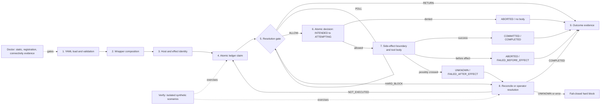

# Mycelium architecture and guarantee map

This document traces the shipped Python runtime from configuration to outcome
evidence. It is deliberately stricter than a feature overview: every guarantee
is conditional on its stated prerequisites and links to both implementation and
tests. It does not claim that installing Mycelium, loading YAML, or passing a
synthetic verification run proves an application's real provider integration.

## Source provenance and review baseline

The reviewed commit, package version, and source hashes are recorded in
[architecture_provenance.json](architecture_provenance.json). Source links below
follow the current module layout, including the extracted execution, recovery,
context, model, and runtime-builder modules.

### Provenance model and guarantees

To eliminate the impossible Git self-reference problem (a tracked architecture document cannot contain the Git commit SHA that includes the document itself), Mycelium couples an **ancestor review base** with a **cryptographic source file manifest**:

1. **Review Base Ancestry**: The manifest's `review_base_commit` is verified to exist in the repository object graph and to be an ancestor of `HEAD`.
2. **Cryptographic Manifest**: [architecture_provenance.json](architecture_provenance.json) records the SHA-256 digests of the Python runtime modules and regression test suites supporting the architecture trace below.

**What this provenance statement guarantees:**
- **Audit Traceability**: Readers and security auditors have an immutable reference to the exact baseline source tree against which architecture guarantees were verified.
- **Automated Drift Detection**: Continuous integration verifies review-base ancestry, linked file coverage, source hashes, and Python line-anchor syntax and bounds. An in-range anchor still needs review to confirm that it points to the intended symbol.
- **Maintainer Update Command**: Maintainers can refresh the provenance baseline with a single deterministic command:
  ```console
  python .github/scripts/update-architecture-provenance.py
  ```

**What this does not prove:**
- A valid provenance record does not guarantee that third-party runtime dependencies (e.g., external Redis or PostgreSQL engines) satisfy their host assumptions (**A**).
- It does not substitute for active synthetic integration tests (exercised via `mycelium verify`).

The companion [failure and threat model](FAILURE_AND_THREAT_MODEL.md) contains the larger failure catalogue and exhaustive guarantee-to-test index.

## Legend

| Mark | Meaning |
|---|---|
| **G** | Runtime guarantee, when all listed prerequisites hold |
| **A** | Host, provider, deployment, or operator assumption |
| **U** | Unsupported boundary; the runtime does not provide this protection |
| **L** | Possible later scope, not a shipped feature or commitment |

## End-to-end map



Doctor and Verify are evidence lanes, not part of a business tool execution.
Outcome recording observes the execution path but is not the authoritative
ledger state machine.

## Architecture trace

| Stage | What enters | What the runtime does | What leaves | Evidence |
|---|---|---|---|---|
| 1. Configuration | YAML, environment-backed storage settings, tool declarations | `load_config()` parses and validates a `MyceliumConfig`; invalid or unsupported configuration raises `ConfigError`. | Typed configuration and per-tool `ToolConfig` | [source](../mycelium/config.py#L341-L361), [parse test](../tests/test_config.py#L72-L83), [invalid-config tests](../tests/test_config.py#L227-L266) |
| 2. Wrapper composition | Tool callable plus logical tool name | `apply_tool()` builds the inner `protect`/`bounded`/ledger layers, then outer loop, budget, scope, state, use-time, destructive, entity, and secret policy layers. Ledger-backed decision policies are combined at one atomic decision boundary. LangGraph instrumentation is outermost when enabled. | A wrapped sync or async callable | [source](../mycelium/runtime_builder.py#L587-L875), [wrapper-order test](../tests/test_missing_run_identity.py#L509-L533), [atomic-policy composition test](../tests/test_decision.py#L213-L255) |
| 3. Request and effect identity | Explicit host `request_id`, `request_id_from`, framework dispatch id, active run scope, tool, canonical args, destination, agent and policy version | The request row key is resolved; consequential calls also derive a destination-aware SHA-256 `effect_id`. Provider idempotency-key fields are excluded from the effect fingerprint so key swapping is detected against the same operation. | Physical `request_id` and authoritative consequential `effect_id` | [request-id source](../mycelium/action_ledger.py#L2067-L2131), [effect-id source](../mycelium/transition.py#L1014-L1205), [identity tests](../tests/test_effect_identity.py#L106-L224), [canonical-row test](../tests/test_effect_id_index.py#L71-L87) |
| 4. Ledger claim | Identity, tool classification, call arguments, storage backend | Read-only, classified side-effecting, and legacy unclassified calls take separate claim paths. Classified side effects first resolve the canonical row by `effect_id`, then atomically claim or resolve existing state. | A fenced `LedgerEntry`, cached result, poll, repair, or hard block | [dispatch source](../mycelium/ledger_execution.py#L85-L105), [claim source](../mycelium/action_ledger.py#L1054-L1296), [entry fields](../mycelium/ledger_model.py#L268-L354), [atomic claim tests](../tests/test_storage_backends.py#L65-L110), [fence tests](../tests/test_atomicity_contract.py#L920-L980) |
| 5. Resolution gate | Existing durable row, lease, boundary, capability, provider key, operator resolution | The state machine chooses `RETURN`, `POLL`, `REPAIR`, `ALLOW`, or `HARD_BLOCK`. Ambiguous `BLIND` effects park. A declared `QUERYABLE` tool without a usable mechanism fails closed. | Safe cached return, waiting, repaired metadata, a claimed attempt, or stopped execution | [claim-loop source](../mycelium/action_ledger.py#L1082-L1296), [capability source](../mycelium/ledger_recovery.py#L624-L702), [gate tests](../tests/test_side_effect_resolution.py), [conformance tests](../tests/test_conformance_tsc007.py) |
| 6. Atomic decision and effect intent | Claimed row, current fence, registered policy facts | The wrapper finalizes policy facts and records the combined decision with the fenced transition from `INTENDED` to `ATTEMPTING`; denial becomes `ABORTED`. Provider-reference, boundary, and completion writes require the allowed attempting phase for protocol rows. | Durable allowed/denied decision and effect intent | [decision write](../mycelium/ledger_execution.py#L179-L256), [execution source](../mycelium/ledger_execution.py#L591-L624), [state model](../mycelium/transition.py#L172-L209), [decision test](../tests/test_decision.py#L190-L210), [state-machine test](../tests/test_effect_state_machine.py#L63-L130) |
| 7. Effect boundary and terminal state | Allowed attempt, live owner/fence, optional use-time facts | `side_effect()` durably advances `not_crossed -> maybe_crossed` before the provider call and `-> crossed` after clean return. Failure classification uses the boundary; successful completion commits with the same owner/fence. | `COMMITTED/COMPLETED`, `ABORTED/FAILED_BEFORE_EFFECT`, or ambiguous `UNKNOWN/FAILED_AFTER_EFFECT` | [boundary source](../mycelium/ledger_context.py#L282-L309), [provider-handle source](../mycelium/ledger_context.py#L124-L148), [body/complete source](../mycelium/ledger_execution.py#L626-L775), [boundary tests](../tests/test_side_effect_boundary.py#L43-L187) |
| 8. Reconciliation | Ambiguous row with optional `external_operation_ref`, read-only reconciler, or operator verdict | `COMPLETED` records provider-confirmed completion without body execution. `NOT_EXECUTED` performs a fenced reset that authorizes one attempt. `UNKNOWN`, missing evidence, or reconciler error hard-blocks. | Settled result, one authorized retry, or durable ambiguity | [contract](../mycelium/reconcile.py#L1-L80), [application source](../mycelium/ledger_recovery.py#L530-L622), [fail-closed source](../mycelium/ledger_recovery.py#L704-L865), [reconcile tests](../tests/test_reconcile.py#L89-L258) |
| 9. Outcome recording | Resolution, body, denial, release, lease, and fence events | `OutcomeEmitter` appends flat event rows. Development `warn` mode logs emitter failure; production `error` mode raises. DTTR derives silent duplicate observations from `body_start` rows and excludes authorized re-execution. | Durable or development telemetry, metric exports, and DTTR | [row/emitter source](../mycelium/outcome_emit.py#L43-L315), [metric projection](../mycelium/outcome_export.py#L100-L171), [event tests](../tests/test_outcome_emit.py#L270-L314), [DTTR tests](../tests/test_outcome_emit.py#L157-L205) |
| 10. Doctor | Configuration and optional connectivity access | Runs registered read-only checks and labels evidence as static, runtime-registration, connectivity, operator-asserted, or not-verifiable. It never executes application tools or LLM calls. | Diagnostic readiness report; no empirical side-effect proof | [engine](../mycelium/doctor/engine.py#L57-L148), [evidence types](../mycelium/doctor/types.py#L17-L44), [non-execution test](../tests/test_doctor.py#L581-L610), [readiness tests](../tests/test_doctor.py) |
| 11. Verify | Doctor-clean configuration and selected scenarios | Creates an isolated namespace and runs registered synthetic scenarios in child processes. Blocking Doctor findings prevent scenarios. File/SQLite evidence is labelled single-node; Redis persistence remains operator-asserted. | Per-scenario empirical evidence and limitations, not provider certification | [engine](../mycelium/verify/engine.py#L199-L330), [scenario registry](../mycelium/verify/registry.py#L13-L28), [evidence type](../mycelium/verify/types.py#L28-L74), [scenario tests](../tests/test_verify.py#L104-L142), [isolation/limitation tests](../tests/test_verify.py#L272-L330) |

## Guarantee map

These guarantees compose only when the protected call actually crosses the
wrapper, a semantically stable identity is used, the configured storage has the
required durability/atomicity for the deployment, and any provider evidence is
truthful.

| ID | Guarantee | Required conditions | Source and tests |
|---|---|---|---|
| G1 | **One initial claim winner.** Concurrent claims for one transition do not both enter the tool body. Peers poll or return the winner's result. | Same canonical effect identity; atomic backend; protected call path | [claim loop](../mycelium/action_ledger.py#L1054-L1296); [file/Redis claim tests](../tests/test_storage_backends.py#L65-L110); [contention Verify test](../tests/test_verify.py#L117-L128) |
| G2 | **Stale workers cannot overwrite the winner.** Every critical claim mutation is conditioned on the current owner/fence. | Backend correctly implements fenced compare-and-set | [entry fence contract](../mycelium/ledger_model.py#L277-L283); [stale-fence tests](../tests/test_atomicity_contract.py#L920-L980); [stale wrapper test](../tests/test_atomicity_contract.py#L476-L514) |
| G3 | **A consequential body starts only after an allowed durable decision.** Denial records `ABORTED` and does not execute the body. | Ledger-backed classified tool; policy wrapper not bypassed | [decision path](../mycelium/ledger_execution.py#L591-L614); [decision tests](../tests/test_decision.py#L190-L255); [manual mutation guard tests](../tests/test_decision.py#L895-L980) |
| G4 | **Stable consequential redispatch deduplicates by effect identity.** Alternate explicit request ids resolve to one canonical effect row and remain aliases. | Canonical, complete, host-owned identity inputs | [effect row contract](../mycelium/ledger_model.py#L339-L352); [canonical index tests](../tests/test_effect_id_index.py#L71-L87); [destination identity tests](../tests/test_effect_identity.py#L122-L189) |
| G5 | **The effect boundary is monotonic and crash-conservative.** A crash after `maybe_crossed` is ambiguous and cannot be treated as definitely not executed. | Provider call is inside `side_effect()` or equivalent manual boundary writes | [boundary source](../mycelium/ledger_context.py#L282-L309); [boundary tests](../tests/test_side_effect_boundary.py#L43-L187); [restart durability test](../tests/test_storage_backends.py#L643-L717) |
| G6 | **Ambiguous mutation fails closed without proof.** Missing reconciler/ref, `UNKNOWN`, or reconciler failure cannot silently authorize a second blind effect. | Classified mutating tool; strict recovery path | [fail-closed reconciliation](../mycelium/ledger_recovery.py#L704-L865); [negative tests](../tests/test_reconcile.py#L189-L258) |
| G7 | **Provider-confirmed completion returns without re-execution.** | Read-only reconciler truthfully returns `COMPLETED`; current fence wins | [result application](../mycelium/ledger_recovery.py#L555-L572); [test](../tests/test_reconcile.py#L134-L158) |
| G8 | **Provider-confirmed non-execution authorizes at most one new attempt.** Concurrent verdicts are resolved by fenced CAS; losers follow the winner. | Truthful `NOT_EXECUTED`; atomic backend | [reset source](../mycelium/ledger_recovery.py#L573-L622); [single retry test](../tests/test_reconcile.py#L160-L187); [race tests](../tests/test_atomicity_contract.py#L629-L806) |
| G9 | **Critical claim storage failure prevents execution.** Completion/failure write failures do not turn uncertainty into permission to retry. | Storage exceptions are surfaced through a supported backend | [wrapper claim-before-body](../mycelium/ledger_execution.py#L403-L464); [failure handling](../mycelium/ledger_execution.py#L679-L732); [outage tests](../tests/test_fail_closed_storage.py) |
| G10 | **Completed redispatch returns cached data without another body run.** | Same identity and readable completed row | [return path](../mycelium/ledger_execution.py#L453-L464); [outcome-backed test](../tests/test_outcome_emit.py#L280-L293) |
| G11 | **Outcome evidence distinguishes authorized recovery from silent duplicate execution.** | `outcome_emit` enabled; emitter writes succeed; consumers retain rows | [row semantics](../mycelium/outcome_emit.py#L61-L92); [authorized retry test](../tests/test_outcome_emit.py#L433-L466); [DTTR tests](../tests/test_outcome_emit.py#L157-L194) |
| G12 | **Doctor and Verify do not touch real application tools.** Doctor is diagnostic; ordinary Verify uses isolated synthetic operations and refuses unsafe isolation. | Built-in commands and scenarios; no custom code that violates their contracts | [Doctor engine](../mycelium/doctor/engine.py#L90-L148); [Doctor test](../tests/test_doctor.py#L581-L610); [Verify isolation source](../mycelium/verify/engine.py#L296-L330); [isolation tests](../tests/test_verify.py#L287-L330) |

### What “at most once” means here

The invariant is not universal exactly-once delivery. For one stable effect
identity, the allowed body-execution count is:

```text
initial winning attempt + one attempt for each consumed, proven NOT_EXECUTED verdict
```

A `COMPLETED` verdict returns evidence without a new attempt. An `UNKNOWN`
verdict authorizes none. This is tested directly by the reconciliation and
atomicity tests linked under G7 and G8.

## Assumptions

| ID | Assumption | Consequence if false | Evidence |
|---|---|---|---|
| A1 | **The host routes every consequential provider call through the wrapped callable.** | Direct provider calls bypass claims, policy decisions, boundary tracking, and outcomes. | Wrapper construction is explicit in [`apply_tool()`](../mycelium/runtime_builder.py#L587-L875); the residual risk is documented in the [threat model](FAILURE_AND_THREAT_MODEL.md#f-residual-risks). |
| A2 | **Identity inputs are server-authoritative, canonical, and semantically complete.** | Missing meaningful fields can collapse distinct effects; model-controlled or changing values can split one effect into several keys. | [request-id guidance in code](../mycelium/action_ledger.py#L2076-L2095), [preimage fields](../mycelium/transition.py#L1094-L1135), [identity-change tests](../tests/test_effect_identity.py#L122-L189). |
| A3 | **The selected backend's atomicity and durability match the topology.** | Memory is process-local; file/SQLite are single-node; Redis persistence is not introspected by Mycelium. | [Doctor topology logic](../mycelium/doctor/engine.py#L36-L54), [backend tests and conditional integration coverage](../tests/test_storage_backends.py), [Verify labels](../mycelium/verify/engine.py#L305-L312). |
| A4 | **A reconciler is read-only and conservative, and its provider observation is truthful.** | A false `NOT_EXECUTED` permits one duplicate effect. | The requirement is a protocol contract in [`Reconciler`](../mycelium/reconcile.py#L68-L80); fail-closed behavior is tested in [`test_reconcile.py`](../tests/test_reconcile.py#L189-L258), but credential scopes are outside that test. |
| A5 | **Provider idempotency behavior and dedupe TTL match the declaration.** | A same-key retry may not be safe after the provider's real window expires. | [binding fields](../mycelium/transition.py#L740-L759), [provider-key tests](../tests/test_provider_key_validity.py), [key enforcement tests](../tests/test_provider_idempotency_key.py). |
| A6 | **Clocks are sufficiently aligned for leases and authority windows.** | Lease expiry or authority checks can occur early or late. | Lease code uses wall-clock time in [`renew_lease()`](../mycelium/action_ledger.py#L1880-L1970); time-bound behavior is tested in [`test_lease_validity.py`](../tests/test_lease_validity.py) and [`test_authority_window.py`](../tests/test_authority_window.py). |
| A7 | **Operators and backend writers are authorized by the host deployment.** | A principal with backend write access can stamp resolution or release data. | The ledger accepts an optional [`OperatorAuthorizer`](../mycelium/operator_auth.py); one-shot semantics are tested in [`test_operator_release.py`](../tests/test_operator_release.py), not the host's IAM. |
| A8 | **Outcome storage is retained and queried correctly.** | Runtime safety can still hold while observability and DTTR evidence are incomplete. | Emitter failure policy is explicit in [`OutcomeEmitter`](../mycelium/outcome_emit.py#L210-L259); failure modes and production requirements are tested in [`test_outcome_emit.py`](../tests/test_outcome_emit.py#L115-L140). |

## Unsupported boundaries

| ID | Not guaranteed | Current boundary evidence |
|---|---|---|
| U1 | **Correct agent reasoning, prompt-injection resistance, or business intent.** Mycelium controls declared execution boundaries, not whether the requested action is wise. | The runtime entry point is a tool wrapper, not a planner: [`apply_tool()`](../mycelium/runtime_builder.py#L587-L875). Optional input/entity guards cover only declared policies; see their negative tests in [`test_entity_guard.py`](../tests/test_entity_guard.py) and [`test_secret_protection.py`](../tests/test_secret_protection.py). |
| U2 | **Automatic interception of direct SDK/database/provider writes.** | Only the returned wrapper establishes `_ActiveTransition` and invokes the ledger path: [`_run_ledgered()`](../mycelium/ledger_execution.py#L377-L775). |
| U3 | **Provider truth or deployed read-only reconciler credentials.** | `Reconciler` is a Python `Protocol`, not a capability sandbox: [`reconcile.py`](../mycelium/reconcile.py#L68-L80). Provider conformance tests are adversarial synthetic checks, not live IAM proof: [`test_provider_conformance.py`](../tests/test_provider_conformance.py). |
| U4 | **Exactly-once remote side effects across an unknowable crash window.** | `maybe_crossed` deliberately maps uncertainty to a block and reconciliation rather than claiming certainty: [`side_effect()`](../mycelium/ledger_context.py#L282-L301), [`test_exception_inside_side_effect_marks_unknown_and_hard_blocks`](../tests/test_side_effect_boundary.py#L99-L122). |
| U5 | **Authority remaining valid during a remote network call.** Validation occurs immediately before the boundary, but the fact can change afterward. | Use-boundary enforcement is visible in [`_run_ledgered()`](../mycelium/ledger_execution.py#L498-L510) and tested in [`test_use_time_currency.py`](../tests/test_use_time_currency.py) and [`test_authority_window.py`](../tests/test_authority_window.py). |
| U6 | **Arbitrary multi-step workflow replay/recovery semantics.** A bounded `@composite` wrapper exists for unchanged straight-line functions, but the ledger is not a Temporal-style workflow engine and does not cover general graphs, conditionals, loops, or hidden effects. | Composite restrictions and parent protocol are documented in [durable composite recovery](COMPOSITE_RECOVERY.md); ordinary shipped decorators remain tool/task boundary wrappers in [`runtime_builder.py`](../mycelium/runtime_builder.py#L587-L983). |
| U7 | **A passing Doctor as proof that calls are wrapped.** Doctor inspects detectable configuration/registration/connectivity and never executes tools. | [`run_doctor()`](../mycelium/doctor/engine.py#L90-L148), [`test_doctor_never_executes_tools`](../tests/test_doctor.py#L581-L610). |
| U8 | **A passing ordinary Verify run as production-provider certification.** Scenarios use isolated synthetic operations; file/SQLite are single-node evidence and Redis persistence remains asserted. | [`run_verify()`](../mycelium/verify/engine.py#L199-L330), [`test_memory_skips_multiprocess_and_warns_redispatch`](../tests/test_verify.py#L272-L284), [`test_isolation_refusal_unknown_backend`](../tests/test_verify.py#L317-L330). |
| U9 | **Hosted dashboards or alerting.** Mycelium emits rows/metrics; operating the monitoring system belongs to the host. | Export projection and sinks stop at [`export_rows()`](../mycelium/outcome_export.py#L334-L338); exporter behavior is tested in [`test_outcome_export.py`](../tests/test_outcome_export.py). |
| U10 | **Native non-Python safety engines.** TypeScript, Go, and other applications can use the shipped local sidecar, but they do not enforce transitions in-process. | The authoritative runtime and state machine remain Python (`sdk/pyproject.toml`, [`mycelium`](../mycelium)); the development-only [`v1alpha1` sidecar](spec/README.md) and thin TypeScript/Go clients provide HTTP/JSON interoperability without duplicating that engine. |

## Later-scope candidates

These are gaps made visible by the current boundary. They are not promised
roadmap items.

| Candidate | Why it is later scope rather than a current guarantee | Current seam |
|---|---|---|
| L1. Host integration for operator release capabilities | Short-lived, scoped, single-use signed capabilities are shipped. Trusted issuance, key management, and a durable nonce backend remain host responsibilities. | [`SignedOperatorReleaseCapabilityAuthorizer`](../mycelium/operator_auth.py#L191), [scope and replay tests](../tests/test_operator_release.py#L717-L868) |
| L2. Policy-engine approval before destructive grant issuance | Operator-release dual control is implemented, while approval before grant issuance remains host-owned. | [`operator_auth.py`](../mycelium/operator_auth.py), [`destructive_confirm.py`](../mycelium/destructive_confirm.py) |
| L3. Credential-scope attestation for reconcilers | Conformance can challenge behavior but cannot prove a live token is read-only. | [`provider_conformance.py`](../mycelium/provider_conformance.py), [`test_provider_conformance.py`](../tests/test_provider_conformance.py) |
| L4. Production cross-language deployment and native engines | Development sidecar profiles include trusted loopback and shared PostgreSQL. Automated local cross-language conformance and a two-sidecar PostgreSQL smoke suite are shipped. Remote hosting, multi-tenancy, production authentication, broader deployment conformance, and independent native engines remain outside that evidence. | [`sidecar.py`](../mycelium/sidecar.py), [conformance scope](../../conformance/README.md), [protocol status](spec/V1ALPHA1_RELEASE_CHECKLIST.md), [TypeScript client](../../clients/typescript/README.md), [Go client](../../clients/go/README.md) |
| L5. General workflow-level recovery orchestration | The bounded composite protocol intentionally stops at straight-line sequential functions; conditional paths, loops, dynamic dispatch, and workflow graphs remain outside its guarantee. | [Composite recovery](COMPOSITE_RECOVERY.md); [`apply_tool()` / `apply_named_task()`](../mycelium/runtime_builder.py#L587-L983) |
| L6. Managed observability UI and alert lifecycle | Outcome rows, DTTR, and exporter sinks exist; storage, dashboards, retention, and paging remain host-owned. | [`outcome_emit.py`](../mycelium/outcome_emit.py), [`outcome_export.py`](../mycelium/outcome_export.py) |

## Evidence interpretation

| Evidence | What a pass supports | What it does not support |
|---|---|---|
| Unit/property tests | The checked implementation invariant under the test's backend and fault model | Deployment wiring, live provider truth, untested interleavings |
| Doctor `PASS` | Configuration and the check's named evidence kind passed | Tool execution, real call-site coverage, provider outcome correctness |
| Verify `PASS` | The selected synthetic scenario passed in its isolated namespace/backend | Application tool safety, real business-provider behavior, production equivalence |
| Cluster attestation | The named multi-worker sandbox sequence and configuration were exercised | All production failures, uncompromised signing keys, or sandbox/production equivalence |
| Outcome rows / DTTR | Recorded execution and resolution events support the computed metric | Events that were never emitted, retained, or routed through Mycelium |

## Review checklist for a concrete deployment

Before translating this map into a deployment claim, verify all of the
following:

1. Every consequential call site uses the final wrapped callable.
2. Each business operation has one stable, server-owned identity across retries.
3. Tool classification and provider capability declarations are truthful.
4. Storage atomicity, durability, namespace, and topology match the deployment.
5. Provider calls use `side_effect()` and record a durable operation reference as
   early as the provider permits.
6. Reconcilers are read-only, conservative under lag/duplicates/errors, and use
   appropriately scoped credentials.
7. Doctor passes with the intended strictness and evidence kinds are reviewed,
   not merely counted.
8. Verify scenarios run on the relevant backend; skips, warnings, and limitations
   remain visible.
9. Production outcome emission is durable and monitored, with DTTR expected at
   `0.0`.
10. Unsupported boundaries above are accepted or mitigated by the host.
